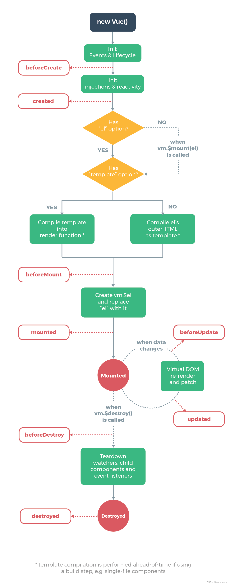
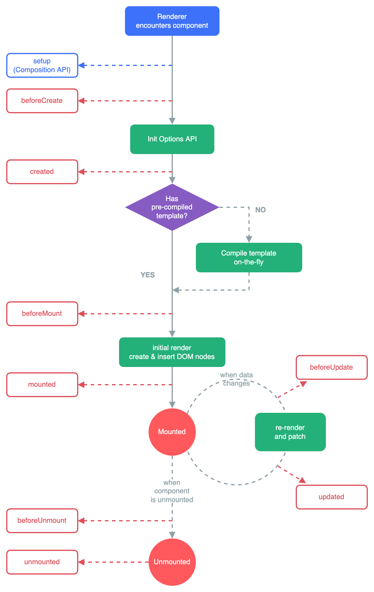

# Vue2和Vue3生命周期的对比

## 一、Vue2和Vue3生命周期对照表

| 触发时机 | vue2.x | vue3.x |
|-------|--------|--------|
| 组件创建时运行 | beforeCreate created | setup |
| 挂载在DOM时运行 | beforeMount mounted | onBeforeMount onMounted |
| 响应数据修改时运行 | beforeUpdate updated | onBeforeUpdate onUpdated |
| 元素销毁前执行 | beforeDestroy destroyed | onBeforeUnmount onUnmounted |
| 管理Keep-Alive组件 | activated deactivated | onActivated onDeactivated|
| Vue3 Debug Hooks | - - | onRenderTriggered onRenderTracked |

## 二、Vue2和Vue3生命周期图示
### 1、Vue2生命周期图

### 2、Vue3生命周期图

