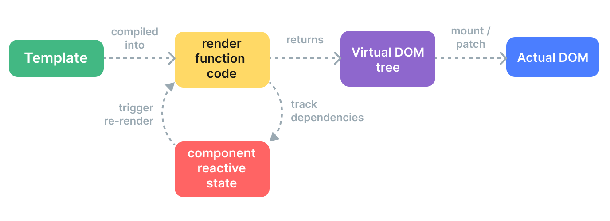

# 对Vue中虚拟DOM的理解及其原理

    本文介绍了Vue中虚拟DOM的概念、工作原理，包括模板到真实DOM的转换过程，以及其带来的性能优化和适用场景。同时讨论了虚拟DOM的优缺点，如初次渲染速度、内存消耗和特定应用的限制。

对 Vue中虚拟DOM的理解及其原理

* 什么是虚拟DOM
* Vue中虚拟DOM的原理
* 使用虚拟DOM的优缺点


## 一、什么是虚拟DOM
```
虚拟DOM(virtual DOM)，简称 vdom，是一个普通的js对象，用来描述真实DOM结构。实际上它只是对真实 DOM 的一层抽象。最终可以通过一系列操作使这棵树映射到真实环境上。相当于在js与DOM之间做了一个缓存，通过比较新旧虚拟DOM树的差异，最终只需要对修改的部分进行实际的DOM操作。
```
```
Vue官网解释：虚拟 DOM (Virtual DOM，简称 VDOM) 是一种编程概念，意为将目标所需的 UI 通过数据结构“虚拟”地表示出来，保存在内存中，然后将真实的 DOM 与之保持同步。这个概念是由 React 率先开拓，随后被许多不同的框架采用，当然也包括 Vue。
```

## 二、Vue中虚拟DOM的原理



#### 1、Vue 组件挂载时会发生如下几件事：

    挂载的过程可以简单总结为：模板 --> 渲染函数 --> 虚拟DOM树 --> 真实DOM

* 编译：Vue 模板被编译为渲染函数：即用来返回虚拟 DOM 树的函数。这一步骤可以通过构建步骤提前完成，也可以通过使用运行时编译器即时完成。
* 挂载：运行时渲染器调用渲染函数，遍历返回的虚拟 DOM 树，并基于它创建实际的 DOM 节点。这一步会作为响应式副作用执行，因此它会追踪其中所用到的所有响应式依赖。
* 更新：当一个依赖发生变化后，副作用会重新运行，这时候会创建一个更新后的虚拟 DOM 树。运行时渲染器遍历这棵新树，将它与旧树进行比较，然后将必要的更新应用到真实 DOM 上去。过程中会通过 diff 算法比较两个虚拟DOM树的差异，通过patch算法将两个虚拟DOM对象的差异应用到真正的DOM树上。

#### 2、过程解释：
```
挂载：一个运行时渲染器将会遍历整个虚拟 DOM 树，并据此构建真实的 DOM 树。这个过程被称为挂载 (mount)。
```
```
更新：如果我们有两份虚拟 DOM 树，渲染器将会有比较地遍历它们，找出它们之间的区别，并应用这其中的变化到真实的 DOM 上。这个过程被称为更新 (patch)，又被称为“比对”(diffing) 或“协调”(reconciliation)。
```
```
渲染函数： 渲染函数是用来生成Virtual DOM的。
```

## 三、使用虚拟DOM的优缺点
#### 1、优点：
```
Vue官网指出：虚拟 DOM 带来的主要收益是它让开发者能够灵活、声明式地创建、检查和组合所需 UI 的结构，同时只需把具体的 DOM 操作留给渲染器去处理。
```

* 跨平台：由于 Virtual DOM 是以 JavaScript 对象为基础而不依赖真实平台环境，所以使它具有了跨平台的能力，比如说浏览器平台、Weex、Node 等。
* 快速的渲染：Vue和其他的前端框架一样，使用了Diff算法来更新DOM。虚拟DOM允许Vue在内存中追踪DOM的状态。在需要更新视图时，Vue会先进行虚拟DOM的比对，然后只应用必要的更改，这比每次都重新渲染整个视图要高效得多。
* 提升渲染性能：Virtual DOM的优势不在于单次的操作，而是在大量、频繁的数据更新下，能够对视图进行合理、高效的更新
虚拟DOM就是为了解决浏览器性能问题而被设计出来的
* 易于集成：虚拟DOM允许Vue与其他库和现有的项目更容易地集成，因为它不依赖于特定的DOM实现。
* 便捷的测试：由于虚拟DOM，Vue使得单元测试变得更加容易，因为你可以在没有实际DOM的情况下进行测试。
* 社区和支持：Vue拥有一个庞大的社区和丰富的生态系统，其中包括了大量的插件和库，可以帮助开发者更快地构建应用。

#### 2、缺点：
```
Vue使用虚拟DOM有一些潜在的缺点，主要是与传统的DOM操作相比，可能会对性能有轻微的影响。这是因为虚拟DOM需要额外的计算来比对虚拟节点树的差异，并最终转换为DOM更新。
```

* 初次渲染更慢：由于需要将虚拟DOM转换为实际DOM，因此在第一次渲染页面时，可能会略微慢一些。
* 不支持一些高级特性：由于虚拟DOM是一个抽象层，它可能不支持某些DOM特性，例如双向数据绑定的输入框（需要特定的处理）。
* 更多内存使用：虚拟DOM需要额外的内存来存储虚拟节点树，这可能会稍微增加页面加载时的内存使用。
* 不适用于某些应用：如果你的应用需要进行大量DOM操作，或者需要直接访问DOM节点（例如，使用第三方DOM库），那么Vue的虚拟DOM可能不适合你的应用。
* 可能的性能问题：在某些极端情况下，虚拟DOM可能会导致性能问题，例如在大型或复杂的列表中，虚拟DOM的diff算法可能会变得低效。


**综上所述**，虚拟DOM带来的性能损失在初始化时可能较为明显，但随着应用状态的变化，性能差距会逐渐减小。在选择是否使用Vue时，需要综合考虑各种因素，包括应用需求、项目规模和开发团队的技术背景等。