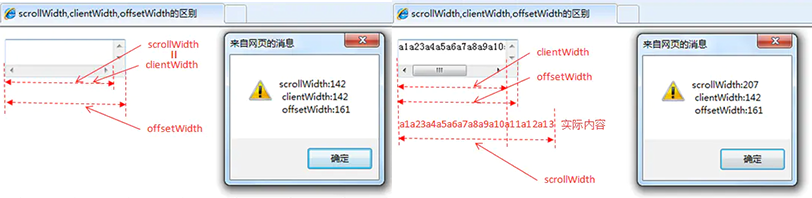

……………………………………………………………
HTML5 & CSS3
……………………………………………………………

# 一、盒子水平垂直居中的方案

### 1、定位：3种
#### (1) absolute + margin // 需要知道宽高

    body { position: relative; }
    .box {
        width: 100px;
        height: 100px;
    
        position: absolute;
        top: 50%;
        left: 50%;
        margin: -50px 0 0 -50px;
    }

#### (2) top, left, right, bottom + margin: auto // 需要有宽高，不用知道具体宽高是多少

    body { position: relative; }
    .box {
        width: 100px;
        height: 100px;
    
        position: absolute;
        top: 0;
        left: 0;
        bottom: 0;
        right: 0;
        margin: auto;
    }

#### (3) absolute + transform // 不需要宽高，有兼容性问题

    body { position: relative; }
    .box {
        position: absolute;
        top: 50%;
        left: 50%;
        transform: translate(-50%, -50%);
    }

### 2、display:flex // 有兼容性问题，移动端常用此方式
    body {
        display: flex;
        justify-content: center;
        align-items: center;
    }

### 3、Javascript
    let HTML = document.documentElement,
        winW = HTML.clientWidth, // 
        winH = HTML.clientHeight, // 
        box = document.getElementById('box'),
        boxW = box.offsetWidth, // 
        boxH = box.offsetHeight; // 

    // 需要设置符合子body的position为relative
    box.style.position = 'absolute';
    box.style.left = (winW - boxW) / 2 + 'px';
    box.style.top = (winH - boxH) / 2 + 'px';
    

### 4、display: table-cell

    body {
        display: table-cell;
        vertical-align: middle;
        text-align: center;
        // => 宽高不能是百分比,必须是固定宽高
    }
    
    .box { display: inline-block; }

# 二、CSS盒子模型

#### 1、标准盒子模型，box-sizing：content-box，盒子大小会随着padding, margin, border改变而改变

#### 2、IE盒子模型，box-sizing: border-box，盒子大小固定，缩放内容

#### 3、flex盒模型
* flex container: 弹性盒子父容器
* flex item: 弹性盒子内容项
* main axis: 主轴，横轴
* cross axis: 交叉轴，纵轴

    * display: 开启弹性盒子模型
    * flex-direction: 属性决定主轴的方向（即项目的排列方向）
    * flex-wrap: 决定布局项目是否可以换行
    * flex-flow: flex-direction和flex-wrap
    * justify-content: 定义项目在主轴上的对齐方式
    * align-items: 定义项目在交叉轴上如何对齐
    * align-content: 定义了多根轴线的对齐方式。如果项目只有一根轴线，该属性不起作用

* 以下属性定义在内容项上：
    * order: 定义项目的排列顺序。数值越小，排列越靠前，默认为0
    * flex-grow: 定义项目的放大比例，默认为0，即如果存在剩余空间，也不放大
    * flex-shrink: 定义了项目的缩小比例，默认为1，即如果空间不足，该项目将缩小
    * flex-basis: 定义了在分配多余空间之前，项目占据的主轴空间
    * flex: 是flex-grow, flex-shrink和flex-basis的简写，默认值为0 1 auto。后两个属性可选
    * align-self: 允许单个项目有与其他项目不一样的对齐方式，可覆盖align-items属性

#### 4、多列布局盒模型

# 三、移动端响应式布局的三大方案

*  @media: 通过媒体查询，写不同的样式（大众化）
*  rem: 等比缩放（大众化）
*  flex: 适用于部分内容的布局
*  vh／vw: 视口分为100分，百分比布局

# 四、简述一下你对HTML语义化的理解？
* 1、用正确的标签做正确的事情
* 2、html语义化让页面的内容结构化，结构更清晰，便于对浏览器、搜索引擎解析
* 3、即使在没有样式css情况下也以一种文档格式显示，并且是容易阅读的
* 4、搜索引擎的爬虫也依赖于HTML标记来确定上下文和各个关键字的权重，利于SEO
* 5、使于都源代码的人对网站更容易将网站分块，便于阅读维护理解

# 五、常见兼容性问题有哪些？
* 1、png24位的图片在IE6浏览器上出现背景；
  * 解决方案是：做成PNG8；

* 2、浏览器默认的margin和padding不同。
  * 解决方案是：加一个全局的*{margin:0;padding:0;}来统一。

* 3、IE6双边距bug：块属性标签float后，又有横行的margin情况下，在IE6显示margin比设置的大。浮动IE产生的双倍距离#box{float:left;width:10px;margin:0 0 0 100px;} 这种情况下IE6会产生200px的距离。
  * 解决方法：加上_display：inline，使浮动忽略

* 4、IE下，可以使用获取常规属性的方法来获取自定义属性，也可以使用getAttribute()获取自定义属性；Firefox下，只能使用getAttribute()获取自定义属性。
  * 解决方法：统一通过getAttribute()获取自定义属性。

* 5、Chrome中文界面下默认会将小于12px的文本强制按照12px显示
  * 解决方法：可通过加入CSS属性-webkt-text-size-adjust:none;解决

* 6、超链接访问过后hover样式就不出现了，被点击访问过的超链接样式不在具有hover和 active；
  * 解决方法：改变CSS属性的排列顺序：L-V-H-A: a:link{}  a:visited{} a:hover{} a:active{}

# 六、简述同步和异步的区别

* 1、同步是阻塞模式，异步是非阻塞模式
* 2、同步就是指一个进程在执行某个请求的时候，若该请求需要一段时间才能返回信息，那么这个进程将会一直等待下去，直到收到返回信息才继续执行下去
* 3、异步是指进程不需要一直等下去，而是继续执行下面的操作，不管其他进程的状态。当有消息返回时系统会通知进程进行处理，这样可以提高执行的效率

# 七、浏览器的内核分别是什么?

* 1、IE浏览器：Trident内核，也是俗称的IE内核；
* 2、Chrome浏览器：统称为Chromium内核或Chrome内核，以前是Webkit内核，现在是Blink内核；
* 3、Firefox浏览器：Gecko内核，俗称Firefox内核；
* 4、Safari浏览器：Webkit内核；
* 5、Opera浏览器：最初是自己的Presto内核，后来是Webkit，现在是Blink内核；

# 八、display:none; 和visibility:hidden;的区别是什么？

* 1、display: none; 彻底消失，释放空间。能引发页面的reflow回流（重排）。
* 2、visibility: hidden; 就是隐藏，但是位置没释放，好比opacity: 0; 不引发页面回流。

# 九、px、em、rem、vh、vw分别是什么？

* 1、px物理像素，绝对单位
* 2、em相对于自身字体大小，如果自身没有大小则相对于父级字体大小，如果父级也没有则一层一层向上查找，直到找到html为止，相对单位
* 3、rem相对于html的字体大小，相对单位
* 4、vh相对于屏幕高度的大小，相对单位
* 5、vw相对于屏幕宽度的大小，相对单位

# 十、CSS清除浮动的方法
* 1、直接设置父元素高度
* 2、额外标签法：在父元素内容的最后添加一个块级元素，给添加的块级元素设置clear: both
* 3、伪元素清除法：给高度塌陷的父元素添加一个:after伪元素，并给这个伪元素设置一定的样式，来清除浮动

        (1)基本写法
        .clearfix:after {
            content: '.';           /*设置内容为空*/
            display: block;         /*将文本转为块级元素*/
            clear: both;            /*清除浮动*/
            /* 补充代码：在网页中看不到伪元素 */
            height: 0;              /*高度为0*/
            visibility: hidden;     /*将元素隐藏*/
        }       
        .clearfix {
            *zoom:1;	/*为了兼容IE*/
        }

        (2)Bootstrap写法：
        .clearfix:before,
        .clearfix:after { /* 清除浮动 */
            content: '';
            display: table;
        }        
        .clearfix:after { /* 真正清除浮动的标签 */
            clear: both;
        } 

# 十一、HTML5新增加了哪些新特性？
* 1、拖放（drag and drop）API
* 2、语义化更好的内容标签（header, nav, footer, aside, article, section）
* 3、音频，视频（audio,  video）API
* 4、画布（Canvas）API
* 5、地理（Geolocation）API
* 6、本地离线存储（localStorage），即长期存储数据，浏览器关闭后数据不丢失
* 7、会话存储（sessionStorage），即数据在浏览器关闭后自动删除
* 8、表单控件包括 calendar, date, time,  email, url,  search
* 9、新的技术包括 webwork,  websocket

# 十二、HTML5中如何实现应用缓存？
* 1、需要指定"manifest"文件，创建一个缓存manifest文件后，在HTML页面中提供manifest链接：

        <html manifest="demo.appcache">
        
        manifest 文件可分为三个部分：
        CACHE MANIFEST - 在此标题下列出的文件将在首次下载后进行缓存
        NETWORK - 在此标题下列出的文件需要与服务器的连接，且不会被缓存
        FALLBACK - 在此标题下列出的文件规定当页面无法访问时的回退页面（比如 404 页面）

* 2、manifest文件的建议的文件扩展名是：".appcache"
* 3、manifest文件的内容类型应是："text/cache-manifest"
* 4、所有manifest文件都以"CACHE MANIFEST"语句开始：

        CACHE MANTEEST
        # version 1.0
        /demo.css
        /demo.js
        /demo.png

* 第一次运行以上文件时，它会添加到浏览器应用缓存中，在服务器宕机时，页面从应用缓存中获取数据。

# 十三、说说你对WebWorker和WebSocket的理解

#### 1、WebWorker：
* WebWorker的作用，就是为JavaScript创造多线程环境，允许主线程创建 Worker线程，将一些任务分配给后者运行
* WebWorker线程一旦新建成功，就会始终运行，不会被主线程上的活动（比如用户点击按钮、提交表单）打断。
* WebWorker的最简单用法是执行计算量大的任务，而不会中断用户界面。

#### 2、WebSocket：
* WebSocket是一种在单个TCP连接上进行全双工通信的协议。
* WebSocket使得客户端和服务器之间的数据交换变得更加简单，允许服务端主动向客户端推送数据。
* 在WebSocket API中，浏览器和服务器只需要完成一次握手，两者之间就直接可以创建持久性的连接，并进行双向数据传输。

# 十四、cookie、sessionStorage、localStorage的区别
#### 1、相同点：
* 都是存储在浏览器端，且同源的

#### 2、不同点：
* 1、cookie数据会在同源的http请求中作为请求头携带，服务端可以通过set-Cookies响应头设置同源cookie的数据，localStorage、sessionStorage不会主动把数据发给服务端，尽在本地保存
* 2、cookie可以通过设置domain和path来设置作用范围，localstorage、sessionstorage不可以
* 3、存储大小限制不同，cookie数据不能超过4k，因为http请求每次都会携带cookie信息，所以cookie只适合存储很小的数据，节省网络资源。sessionStorage、localStorage存储大小限制为5M或更大
* 4、数据有效期：sessionStorage进在当前浏览器窗口关闭之前有效。localStorage始终有效，主要用作持久数据。cookie可设置过期时间，过期之前一直有效，如果不设置过期时间则浏览器关闭就无效

# 十五、script标签的async和defer属性有什么区别？
* 1、script没有defer或async，浏览器会立即加载并执行指定的脚本，也就是说不等待后续载入的文档元素，读到就加载并执行。
* 2、defer属性表示延迟执行引入的JavaScript，即这段JavaScript加载时，HTML并未停止解析，这两个过程是并行的。当整个document解析完毕后再执行脚本文件，在DOMContentLoaded事件触发之前完成。多个脚本按顺序执行。
* 3、async属性表示异步执行引入的JavaScript，与defer的区别在于，如果已经加载好，就会开始执行，也就是说它的执行仍然会阻塞文档的解析，只是它的加载过程不会阻塞。多个脚本的执行顺序无法保证。

……………………………………………………………
JAVASCRIPT
……………………………………………………………

# 一、原型和原型链
#### 1、原型：
* (1) 每个函数都有一个prototype属性，被称为显示原型
* (2) 每个实例对象都会有__proto__属性,其被称为隐式原型
* (3) 每一个实例对象的隐式原型__prot__属性指向自身构造函数的显式原型prototype
* (4) 每个prototype原型都有一个constructor属性，指向它关联的构造函数。

#### 2、原型链：
* 获取对象属性时，如果对象本身没有这个属性，那就会去他的原型__proto__上去找，如果还查不到，就去找原型的原型，一直找到最顶层(Object.prototype)为止。Object.prototype对象也有__proto__属性值为null。

#  二、判断一个数据的类型的方法
#### 1、使用typeof。
* 注意：对于null及数组、对象，typeof均检测出为object，不能进一步判断它们的类型。

#### 2、使用instanceof
* obj instanceof Object，可以左边放你要判断的内容，右边放类型来进行JS类型判断，只能用来判断复杂数据类型，因为instanceof 是用于检测构造函数（右边）的prototype属性是否出现在某个实例对象（左边）的原型链上。

#### 3、使用Object.prototype.toString.call
* 在任何值上调用Object原生的toString() 方法，都会返回一个[object NativeConstructorName]格式的字符串。每个类在内部都有一个[[Class]]属性，这个属性中就指定了上述字符串中的构造函数名。
* 但是它不能检测非原生构造函数的构造函数名。

#### 4、使用constructor
* 注意：constructor不能判断undefined和null，并且使用它是不安全的，因为constructor的指向是可以改变的

#  三、从输入框输入一个url到加载完页面的过程
#### 从输入URL到页面加载的主干流程如下：
* 1、浏览器的地址栏输入URL并按下回车
* 2、浏览器查找当前URL的DNS缓存记录
* 3、DNS解析URL对应的IP
* 4、根据IP建立TCP连接（三次握手）
* 5、HTTP发起请求
* 6、服务器处理请求，浏览器接收HTTP响应
* 7、渲染页面，构建DOM树
* 8、关闭TCP连接（四次挥手）

#  四、js中加减过程中如何避免精度丢失
* 丢失原因：
    * 计算机将数据存储为二进制
* 解决方法：
    * 1、第三方库Decimal
    * 2、bignumber
    * 3、变成整数（转换成字符串，然后计算小数部分加减，然后再转换成数值类型）

#  五、hybrid项目如何调用原生api
* 1、通过url传输数据：（一般是在入口页面传下app的用户信息进来供vue h5使用）
* 2、原生APP提供一个接口对象的引用（例如一个扫码的接口，可能还有回调函数以获得扫码结果）（思路就是万物通过window 进行交互）

#  六、常用的响应码

#### HTTP 响应码，也称http状态码(HTTP Status Code)，反映了web服务器处理HTTP请求状态，每一个响应码都代表了一种服务端反馈的响应状态。

#### HTTP响应码通常分为五大类：

* 1XX——信息类（Information），表示收到http请求，正在进行下一步处理，通常是一种瞬间的响应状态

* 2XX——成功类（Successful），表示用户请求被正确接收、理解和处理
    * 200（OK）：请求成功。一般用于GET与POST请求
    * 201（Created）：已创建。成功请求并创建了新的资源
    * 202（Accepted）：请求已被接受，但尚未处理

* 3XX——重定向类（Redirection），表示没有请求成功，必须采取进一步的动作
    * 301（Moved Permanently）：资源被永久移动。请求的资源已被永久的移动到新URI，返回信息会包括新的URI，浏览器会自动定向到新URI。今后任何新的请求都应使用新的URI
    * 302（Found）：资源临时移动。资源只是临时被移动，客户端应继续使用原有URI
    * 304：用其他策略获取资源

* 4XX ——客户端错误（Client Error），表示客户端提交的请求包含语法错误或不能正确执行
    * 400（Bad Requests）：客户端请求的地址不存在或者包含不支持的参数
    * 401（Unauthorized）：未授权，或认证失败。对于需要登录的网页，服务器可能返回此响应
    * 403（Forbidden）：没权限。服务器收到请求，但拒绝提供服务
    * 404（Not Found）：请求的资源不存在。遇到404首先检查请求url是否正确

* 5XX ——服务端错误（Server Error），表示服务器不能正确执行一个正确的请求（客户端请求的方法及参数是正确的，服务端不能正确执行，如网络超时、服务僵死，可以查看服务端日志再进一步解决）
    * 500（Internal Server Error）：服务器内部错误，无法完成请求
    * 503（Service Unavailable）：由于超载或系统维护（一般是访问人数过多），服务器无法处理客户端的请求，通常这只是暂时状态

# 七、http协议与https协议的区别

#### 1、HTTP和HTTPS的基本概念
* HTTP：是互联网上应用最为广泛的一种网络协议，是一个客户端和服务器端请求和应答的标准（TCP），用于从WWW服务器传输超文本到本地浏览器的传输协议，它可以使浏览器更加高效，使网络传输减少。
* HTTPS：是以安全为目标的HTTP通道，简单讲是HTTP的安全版，即HTTP下加入SSL层，HTTPS的安全基础是SSL，因此加密的详细内容就需要SSL。
* HTTPS协议的主要作用可以分为两种：一种是建立一个信息安全通道，来保证数据传输的安全；另一种就是确认网站的真实性。

#### 2、HTTPS和HTTP的区别主要如下：
* (1) https协议需要到ca申请证书，一般免费证书较少，因而需要一定费用。
* (2) http是超文本传输协议，信息是明文传输，https则是具有安全性的ssl加密传输协议。
* (3) http和https使用的是完全不同的连接方式，用的端口也不一样，前者是80，后者是443。
* (4) http的连接很简单，是无状态的；HTTPS协议是由SSL+HTTP协议构建的可进行加密传输、身份认证的网络协议，比http协议安全。

# 八、常用的设计模式

#### 1、单例模式
单例模式是一种常用的软件设计模式，其定义是单例对象的类只能允许一个实例存在。目标为实现一个类，让这个类只有一个实例对象，即多次new这个类，也只返回第一次实例化时生成的对象，

* 适用场景：
    * 需要生成唯一序列的环境
    * 需要频繁实例化然后销毁的对象
    * 创建对象时耗时过多或者耗资源过多，但又经常用到的对象 

#### 2、观察者模式(发布订阅模式)
观察者模式：当对象之间存在一对多的依赖关系时，其中一个对象的状态发生改变，所有依赖它的对象都会收到通知，这就是观察者模式。
发布者订阅者模式：基于一个事件通道，希望接收通知的对象Subscriber 通过自定义事件订阅主题，被激活事件的对象 Publisher 通过发布主题事件的方式通知订阅者该主题的 Subscriber 对象。
观察者模式是，当被观察者的数据发生变化时，调用被观察者的notify方法，去通知所有观察者执行update方法进行更新。对于发布者订阅者模式，首先发布者与订阅者互相并不知道彼此的存在，他们是通过事件中心来进行调度的，发布者在事件中心发布一个对应的事件主题，订阅者在事件中心订阅一个事件主体，当订阅者去触发emit时就去执行发布者所发布的事件。
Vue展示了其设计模式的案例体现，Vue的双向数据绑定使用了观察者模式，其事件总线EventBus使用了发布者订阅者模式。

* 适用场景：
    * 双向绑定
    * Dom事件，addEventListener()

#### 3、策略模式
策略模式是指定义一系列算法，将这些算法一个个封装起来。一个基于策略模式的程序主要分为两部分，一部分是策略类，主要负责具体实现，另一部分是环境类，接收请求并将请求分配给某一个策略类

#### 4、工厂模式
工厂模式定义了一个用于创建对象的接口,这个接口由子类决定实例化哪一个类。该模式使一个类的实例化延迟到了子类。而子类可以重写接口方法以便创建的时候指定自己的对象类型。

* 如果不想让某个子系统与较大的那个对象之间形成强耦合，而是想运行时从许多子系统中进行挑选的话，那么工厂模式是一个理想的选择；
* 将new操作简单封装，遇到new的时候就应该考虑是否用工厂模式；
* 需要依赖具体环境创建不同实例，这些实例都有相同的行为，这时候我们可以使用工厂模式，简化实现的过程，同时也可以减少每种对象所需的代码量，有利于消除对象间的耦合，提供更大的灵活性。

# 九、数组去重
#### 1、双重for循环
    function uniqueArr(arr) {
        let newArr = []
        let isRepeat

        for(let i=0; i<arr.length; i++) { // 第一次循环
            isRepeat = false
            for(let j= i + 1; j < arr.length; j++) { //第二次循环
                if(arr[i] === arr[j]){
                    isRepeat = true
                    break
                }
            }
            if(!isRepeat){
                newArr.push(arr[i])
            }
        }
        return newArr
    }

#### 2、利用数组下标索引过滤
    function uniqueArr(arr) {
        let temp = []
        for(let i = 0; i < arr.length; i++){
            // 如果当前数组的第i项在当前数组中第一次出现的位置是i
            if (arr.indexOf(arr[i]) === i){
                temp.push(arr[i])
            }
        }
        return temp
    }

#### 3、Set + 扩展运算符
    function uniqueArr(arr){
        return Array.from(new Set(arr)) // Set数据结构，其成员的值都是唯一的，利用Array.from将Set结构转换成数组
    }

#### 4、indexof去重方法
    function uniqueArr(arr) {
        let temp = []
        for(let i = 0; i < arr.length; i++){
            if (temp.indexOf(arr[i]) === -1){ // 如果临时数组里面没有这个数就把这个数存进去
                temp.push(arr[i]);
            }
        }
        return temp
    }

# 十、防抖和节流

#### 1、防抖
函数防抖是指在事件被触发n秒后再执行回调，如果在这n秒内事件又被触发，则重新计时。

* 适用场景：
    * 按钮提交场景：防⽌多次提交按钮，只执⾏最后提交的⼀次。 
    * 服务端验证场景：表单验证需要服务端配合，只执⾏⼀段连续的输⼊事件的最后⼀次，还有搜索联想词功能等场景

* 防抖源代码

        function debounce(fn, delay){
            let timerId = null
            return function() {
                const context = this
                if(timerId) {
                    window.clearTimeout(timerId)
                }
                timerId = setTimeout(() => {
                    fn.apply(context, arguments)
                    timerId = null
                }, delay)
            }
        }
        const debounced = debounce(() => console.log('hi'))
        debounced()

#### 2、节流
函数节流是指规定一个单位时间内，只能有一次触发事件的回调函数执行，如果在同一个单位时间内某事件被触发多次，只有一次能生效。控制频率！

* 适用场景：
    * 拖拽场景：scroll滚动条事件，固定时间内只执⾏⼀次，防⽌超⾼频次触发位置变动
    * 缩放场景：监控浏览器resize事件

* 节流源代码

        function throttle(fn, delay){
            let canUse = true
            return function(){
                if (canUse){
                    fn.apply(this, arguments)
                    canUse = false
                    setTimeout(()=> canUse = true, delay)
                }
            }
        }
        const throttled = throttle(()=>console.log('hi'))
        throttled()

#### 3、总结
* 防抖：防止抖动，单位时间内事件触发会被重置，避免事件被误伤触发多次。代码实现重在清零 clearTimeout。业务场景有避免登录按钮多次点击的重复提交。
* 节流：控制流量，单位时间内事件只能触发一次。代码实现重在开锁关锁 timer=timeout; timer=null

# 十一、闭包（closure）

#### 1、定义：
指的是一个函数可以访问另一个函数作用域中变量。常见的构造方法，是在一个函数内部定义另外一个函数。内部函数可以引用外层的变量；外层变量不会被垃圾回收机制回收。
注意，闭包的原理是作用域链，所以闭包访问的上级作用域中的变量是个对象，其值为其运算结束后的最后一个值。

    function f1(){
        var n=999;
        function f2(){
            alert(n); // 999
        }
    }

* 在上面的代码中，函数f2就被包括在函数f1内部，这时f1内部的所有局部变量，对f2都是可见的。
* 但是反过来就不行，f2内部的局部变量，对f1就是不可见的。
* 这就是Javascript语言特有的"链式作用域"结构（chain scope），子对象会一级一级地向上寻找所有父对象的变量。
* 所以，父对象的所有变量，对子对象都是可见的，反之则不成立。

#### 2、优缺点：
* 优点：
    * 允许函数外部访问函数内部变量
    * 可以有效减少全局变量的使用，避免全局变量污染

* 缺点：
    * 父作用域关联对象会一直存储在内存中得不到释放，易导致内存泄漏。
    * 由于函数外部可以访问函数内部变量，数据不安全

# 十二、如何取消Promise请求

#### 方案1：借助reject 方法
一个promise对象状态的改变是通过resolve和reject来执行的。所以可以借助reject方法来终止Promise请求
    
    // 返回一个promise和abort方法
    function getPromise() {
        let _res, _rej
        const promise = new Promise((resolve, reject) => {
            _res = resolve
            _rej = reject
            setTimeout(() => {
                resolve('123')
            }, 5000)
        })
        return {
            promise,
            abort: () => {
                _rej({
                    name: "abort",
                    message: "the promise is aborted",
                    aborted: true,
                });
            }
        };
    }
    
    const { promise, abort } = getPromise();
    promise.then(console.log).catch(e => {
        console.log(e);
    });
    
    abort();

#### 方案2：返回一个pending状态的Promise，原Promise链会终止
    Promise.resolve().then(() => {
        console.log('ok1')
        return new Promise(()=>{})  // 返回“pending”状态的Promise对象
    }).then(() => {
        // 后续的函数不会被调用
        console.log('ok2')
    }).catch(err => {
        console.log('err:', err)
    })

# 十三、数组中forEach, map,filter, reduce等方法的异同

####  1、相同点
* map、filter、forEach执行匿名函数支持三个参数，分别是：当前元素、当前元素索引、当前元素所属的数组
* 匿名函数this指向window
* 只能遍历数组

#### 2、不同点
* map速度比forEach快
* map和filter返回新数组，不会影响原数组；forEach不会产生新数组，返回undefined，reduce把数组缩减为一个值（求和，求积）
* reduce有4个参数，第一个为初始值

# 十四、浅拷贝和深拷贝

#### 1、浅拷贝：分两种情况
如果属性是基本类型，会新开辟一个内存空间。
如果属性是引用类型，引用类型属性是还是指向同一块内存地址，所以如果其中一个对象改变了这个地址，就会影响到另一个对象。

* 实现方式：
    * Object.assign() 方法可以把任意多个的源对象自身的可枚举属性拷贝给目标对象，然后返回目标对象。 
    * 展开运算符
    * Array.prototype.concat()
    * Array.prototype.slice()

#### 2、深拷贝：
将一个对象从内存中完整的拷贝一份出来，从堆内存中开辟一个新的区域存放新对象，且修改新对象不会影响原对象。

* 实现方式：
* JSON.parse(JSON.stringify(data)) (JSON.stringify()在对象中遇到 undefined、function 和 symbol 时会自动将其忽略，在数组中则会返回 null，以保证单元位置不变)
* 递归：

        function deepClone(data) {
            let container
            let type = Object.prototype.toString.call(data).slice(8, -1)

            if(type === 'String' || type === 'Boolean' || type === 'Number' || data === null) {
                return data
            }

            if (data instanceof RegExp) {
                return new RegExp(data)
            }

            if (data instanceof Date) {
                return new Date(data)
            }

            if (type === 'Object') {
                container = {}
            }
            if (type === 'Array') {
                container = []
            }

            for (let k in data) {
                let type = Object.prototype.toString.call(data[k]).slice(8, -1)
                if (type === 'Array' || type === 'Object') {
                    container[k] = deepClone(data[k]);
                } else {
                    container[k] = data[k];
                }
            }
            return container
        }

        let obj1 = {
            title: 'hello',
            flag: true,
            arr: [1, 2, { text: 'blablabla', run: function() {console.log('run!')}}],
            person: { name: 'peter', age: 20 },
            reg: /^\d+$/
        }

        // let obj1 = 'hello world'
        // let obj1 = false

        let obj2 = deepClone(obj1)
        console.log('obj2 - 1:', obj2)
        obj2.person = { name: 'peter', age: 18 }
        console.log('obj2 - 2:', obj2)
        console.log('obj1:', obj1)

# 十五、栈和堆的区别？
* 栈（stack）：由编译器自动分配释放，存放函数的参数值，局部变量等；
* 堆（heap）：一般由程序员分配释放，若程序员不释放，程序结束时可能由操作系统释放。

# 十六、谈谈this的理解？
* this总是指向函数的直接调用者（而非间接调用者）
* 如果有new关键字，this指向new出来的那个对象
* 在事件中，this指向目标元素，特殊的是IE的attachEvent中的this总是指向全局对象window

# 十七、new一个实例的过程
* (1) 在内存中创建一个新对象
* (2) 这个新对象内部的[[Prototype]]特性被赋值为构造函数的 prototype 属性
* (3) 构造函数内部的this被赋值为这个新对象（即this指向新对象）
* (4) 执行构造函数内部的代码（给新对象添加属性）
* (5) 如果构造函数返回非空对象，则返回该对象；否则，返回刚创建的新对象

# 十八、同步和异步的区别?
同步的概念在操作系统中：不同进程协同完成某项工作而先后次序调整（通过阻塞、唤醒等方式），同步强调的是顺序性，谁先谁后。异步不存在顺序性。

* 同步：浏览器访问服务器，用户看到页面刷新，重新发请求，等请求完，页面刷新，新内容出现，用户看到新内容之后进行下一步操作。
* 异步：浏览器访问服务器请求，用户正常操作，浏览器在后端进行请求。等请求完，页面不刷新，新内容也会出现，用户看到新内容。

# 十九、call和applyd的区别？
call()方法和apply()方法的作用相同，动态改变某个类的某个方法的运行环境。他们的区别在于接收参数的方式不同。
区别：

* 在使用call()时，传递给函数的参数必须逐个列举出来
* 使用apply()时，传递给函数的是参数数组

# 二十、JavaScript的数据类型有哪些
* 基本数据类型：字符串（String）、数值(Number)、布尔(Boolean)、空值（Null）、未定义（Undefined）、Symbol。
* 引用数据类型：对象(Object)、数组(Array)、函数(Function)。

……………………………………………………………
ES6
……………………………………………………………
# 一、let、const、var的区别
* 变量提升
* 暂时性死区
* 块级作用域
* 初始值设置：var和let可以不设置初始值，const 声明变量必须设置初始值
* 重复声明：let和const不允许重复声明变量
* 数据修改：const 定义的常量是基本数据类型，不能修改所以不能被修改。引用数据类型在栈内存中存储的是一个指针，真正的数据存储在指针指向的堆地址，不可被修改的是指针，真正的数据是可变的。

# 二、解构赋值
* 数组的解构赋值
* 对象的解构赋值

# 三、模板字符串``(反引号)

* 使用回车换行：标签与标签之 间能直接换行使用
* 变量、表达式拼接：直接使用${} 进行拼接

# 四、箭头函数
* 箭头函数中的this指向的是外层作用域下this的值
* 没有自己的arguments对象，但是可以访问外围函数的arguments对象
* 不能通过new关键字调用
* 适合使用箭头函数的场景： 与this无关的回调设置。定时器、数组方法回调。
* 不适合使用箭头函数的场景： 与this有关的回调设置。事件回调、对象中的方法。

# 五、扩展运算符
...能将「数组」转为逗号分隔的「参数序列]，是rest的逆运算

* 数组的展开
* 对象的展开

# 六、Symbol
* Symbol 是ES6新引入的一种原始数据类型，表示独一无二的值。它是js第七种数据类型 是一种类似于字符串的数据类型。

* 特点：
    * Symbol 的值是唯一的，常用来解决命名冲突问题。
    * Symbol 的值不能和其他数据进行运算。

* 创建方法：

        let h = Symbol()
        console.log(h) // Symbol()
        console.log(typeof h) // "symbol"
​

# 七、集合（set）
* Set是es6新增的数据结构，类似于数组，但是成员的值都是唯一的，没有重复的值，我们一般称为集合。
* 方法：add()、delete()、has()、clear()

        
        const s = new Set([1,2,3,41,12,21,1,1,1,2,3,4]) // 声明集合
        console.log(s); //[1,2,3,41,12,21,4] // 去重
        
        console.log(s.size); //7 // 1.元素个数

        s.add(8) // 2.添加
        
        s.delete(1) // 3.删除
        console.log(s); // [2,3,41,12,21,4,8]
        
        console.log(s.has(2)); //true // 4.检测是否包含某个元素
        
        s.clear() // 5.清空
        console.log(s); // []

* 应用场景： 数组去重、求交、并、差集。

# 八、字典（Map）
* Map类型是键值对的有序列表，而键和值都可以是任意类型
* 属性和方法：size()、set()、get()、has()、delete()、clear()

# 九、Promise
Promise是ES6引入的异步编程的新解决方案。比传统的解决方案（回调函数）更加合理和更加强大
* 状态：pending（进行时）、fulfilled（已成功）、rejected（已失败）
* 用法： Promise对象是一个构造函数，会接受一个函数作为参数，这个函数的两个参数分别是 resolve和reject
    * pedding表示程序正在执行但未得到结果，即异步操作没有执行完毕
    * resolve函数的作用是将Promise对象的状态从 “未完成” 变为 “成功”
    * reject函数的作用是将Promise对象的状态从 “未完成” 变为 “失败”
    * const promise = new Promise(function(resolve, reject) {});
* 实例方法：
    * then() ---- 实例状态发生变化时，触发的回调函数，第一个参数是resolved状态的回调函数，第二个参数是rejected的回调函数（一般使用catch方法来替代第二个参数）
    * catch() ---- 用于指定发生错误的回调函数
    * finally() --- 用于指定 不管 Promise 对象最后状态如何，都会执行的操作

            promise
            .then(result => {···})
            .catch(error => {···})
            .finally(() => {···})

* 常用的构造函数方法：
    * Promise.all() ----将多个 Promise 实例包装成一个新的 Promise 实例
    * const p = Promise.all([p1, p2, p3]);
    * 只有 p1,p2,p3 状态全为 fulfilled，p的状态才会变成fulfilled。此时，p1,p2,p3 的返回值组成一个数组，传递给 p 的回调函数。
    * 只要 p1,p2,p3 有一个状态为 rejected，那么p的状态就变成rejected。此时第一个被reject的实例的返回值，会传递给p的回调函数。
    
    * Promise.race() ----将多个 Promise 实例包装成一个新的Promise实例
    * const p = Promise.race([p1, p2, p3]);
    * 三者谁先改变状态， p也就会跟着改变状态。率先改变的会将返回值传递给p的回调函数。

# 十、类（class）
ES6 引入了class类这个概念，通过class关键字可以定义类，这就是更符合我们平时所理解的面向对象的语言

* 类的声明：class...
* 类的继承：extends
* 静态属性：静态属性不能被子类继承，静态属性只能通过类名来调用，不能通过类的实例来调。
* 静态方法：静态方法中的this，指向的是类class，不是类的实例。因此静态方法只能通过类名来调用，不能通过实例来调用。

# 十一、谈谈你对async/await的理解
* async...await是基于promise的generator语法糖，它用来等待promise的执行结果，常规函数使用await没有效果
* async修饰的函数内部return不会得到预期的结果，会得到一个promise对象
* await等待的promise结果是resolve状态的内容，await 可以阻塞后面代码的执行，reject状态的内容需要使用try...catch获取
* await关键字必须要出现在async修饰的函数中，否则报错

# 十二、谈谈你对promise的理解
* promise用来解决异步回调问题，由于js是单线程的，很多异步操作都是依靠回调方法实现的，这种做法在逻辑比较复杂的回调嵌套中会相当复杂，也叫做回调地狱
* promise用来将这种繁杂的做法简化，让程序更具备可读性，可维护性
* promise内部有三种状态，pedding，fulfilled，rejected
* pedding表示程序正在执行但未得到结果，即异步操作没有执行完毕，fulfilled表示程序执行完毕，且执行成功，rejected表示执行完毕但失败。
* promise和回调函数一样，都是要解决数据的传递和消息发送问题，promise中的then一般对应成功后的数据处理，catch一般对应失败后的数据处理。

# 十三、箭头函数有哪些特性
* 1、箭头函数是匿名函数，不绑定自己的this,arguments,super,new.target
* 2、箭头函数会捕获其所在上下文的this值，作为自己的this值，在使用call/apply绑定时，相当于只是传入了参数，对this没有影响
* 3、箭头函数不绑定arguments，取而代之用rest参数…解决
* 4、箭头函数当方法使用的时候，没有定义this绑定
* 5、箭头函数不能作为构造函数，和 new 一起用就会抛出错误
* 6、箭头函数没有原型属性
* 7、不能简单返回对象字面量，要用（包起来）

……………………………………………………………
WEBPACK
……………………………………………………………

# 一、谈谈你对Webpack的理解
* webpack是一个静态模块打包器，当webpack处理应用程序时，会递归构建一个依赖关系图，其中包含应用程序需要的每个模块，然后将这些模块打包成一个或多个bundle。

# 二、Webpack的运行流程
* 命令行执行npx webpack打包命令开始：
    * 1、初始化编译参数：从配置文件和shell命令中读取与合并参数
    * 2、开始编译：根据上一步得到的参数初始化Compiler对象，加载所有配置的Plugin，执行对象的 run 方法开始执行编译
    * 3、确定入口：根据配置中的entry找出所有的入口文件
    * 4、编译模块：从入口文件触发，调用所有配置的Loader对模块进行翻译，再找出该模块依赖的模块，然后递归本步骤直到所有入口依赖的文件都进行翻译
    * 5、完成模块编译：在经过第4步使用 Loader 翻译完所有模块后，得到了每个模块被翻译后的最终内容以及它们之间的依赖关系图
    * 6、输出资源：根据依赖关系图，组装成一个个包含多个模块的Chunk，再把每个Chunk转化成一个单独的文件加入到输出列表，根据配置确定输出的路径和文件名，输出

* 在以上过程中，Webpack 会在特定的时间点广播出特定的事件，插件在监听到感兴趣的事件后会执行特定的逻辑。

# 三、Webpack中loader是什么？
* loader本质就是一个函数，loader是webpack中提供了一种处理多种文件格式的机制，因为webpack只认识JS和JSON，所以Loader相当于翻译官，将其他类型资源进行预处理，用于对模块的"源代码"进行转换。

# 四、常见的loader有哪些？
* style-loader：将css添加到DOM的内联样式标签style里，然后通过 dom 操作去加载 css。
* css-loader：允许将css文件通过require的方式引入，并返回css代码。
* less-loader：处理less，将less代码转换成css。
* sass-loader：处理sass，将scss/sass代码转换成css。
* postcss-loader：用postcss来处理css。
* autoprefixer-loader：处理css3属性前缀，已被弃用，建议直接使用postcss。
* file-loader：分发文件到output目录并返回相对路径。
* url-loader：和file-loader类似，但是当文件小于设定的limit时可以返回一个Data Url。
* babel-loader：用babel来转换ES6文件到ES。

# 五、plugin有什么作用？
* Plugin功能更强大，主要目的就是解决loader无法实现的事情，比如打包优化和代码压缩等。
* Plugin加载后，在webpack构建的某个时间节点就会触发plugin定义的功能，帮助webpack做一些事情。实现对webpack的功能扩展。

# 六、常见的Plugin有哪些
* html-webpack-plugin：简化 HTML 文件创建 (依赖于 html-loader)
* uglifyjs-webpack-plugin：不支持 ES6 压缩 (Webpack4 以前)
* webpack-parallel-uglify-plugin：多进程执行代码压缩，提升构建速度
* mini-css-extract-plugin：分离样式文件，CSS 提取为独立文件，支持按需加载 (替代extract-text-webpack-plugin)
* optimize-css-assets-webpack-plugin：主要是用来压缩css文件
* clean-webpack-plugin：目录清理
* copy-webpack-plugin：复制文件到出口文件夹
* webpack-bundle-analyzer：打包结果分析工具， 执行打包命令后会弹出当前项目所有的依赖，及其详细信息

# 七、Webpack Proxy代理
在项目开发中不可避免会遇到跨越问题，Webpack中的Proxy就是解决前端跨域的方法之一。所谓代理，指的是在接收客户端发送的请求后转发给其他服务器的行为，webpack中提供服务器的工具为webpack-dev-server。

    module.exports = {
        devServer: {
            contentBase: path.join(__dirname, 'dist'),
            compress: true,
            port: 9000,
            https: true, // 开启https模式
            proxy: {
                '/api': { // 匹配访问路径中含有 '/api' 的路径
                    target: 'https://api.github.com',
                    changeOrigin: true,// 如果接口跨域，需要进行这个参数配置
                    ws: true, // 是否开启websocket代理
                    pathRewrite: {
                      '^/api': '' // 将开头的 '/api' 替换成空字符串
                    }
                }
            }
        }
    }

# 八、如何借助Webpack来优化性能
作为一个项目的打包构建工具，常见的优化手段有如下几个方面：
* JS代码压缩
* CSS代码压缩
* Html文件代码压缩
* 文件大小压缩
* 图片压缩
* Tree Shaking
* 代码分离
* 内联chunk

……………………………………………………………
REACT
……………………………………………………………

# 一、React生命周期

#### 1、初始化阶段：
* getDefaultProps：获取实例的默认属性
* getInitialState：获取每个实例的初始化状态
* componentWillMount：组件即将被装载、渲染到页面上
* render：组件在这里生成虚拟的DOM节点
* componentDidMount：组件真正在被装载之后

#### 2、运行中状态：
* componentWillReceiveProps：组件将要接收到属性的时候调用
* shouldComponentUpdate：组件接受到新属性或者新状态的时候（可以返回false，阻止render调用）
* componentWillUpdate：组件即将更新不能修改属性和状态
* render：组件重新描绘
* componentDidUpdate：组件已经更新

#### 3、销毁阶段：
* componentWillUnmount：组件即将销毁(清除定时器，销毁一些内存占用)

#### 4、在React16废除以下三个生命周期：componentWillMount，componentWillReceiveProps，componentWillUpdate
* 废弃的原因，是在React16的Fiber架构中，可以中间进行暂停重启操作，调和过程会多次执行will周期，不再是一次执行，失去了原有的意义。
* 此外，多次执行，在周期中如果有setState或dom操作，会触发多次重绘，影响性能，也会导致数据错乱。 因而会有UNSAFE开头。

#### 5、两个新的生命周期
* getDerivedStateFromProps：该生命周期是从父获取数据时使用的，返回一个新状态和页面当前状态组合
* getSnapshotBeforeUpdate：从字面理解在更新前获取当前dom结构的快照，拿到更新前页面的各种状态。例如你在渲染前浏览器滚动条scrollTop，更新后会变化，你就可以记住当前状态进行计算。

#  二、对于store的理解
#### Store是reach项目的中央仓库，是把action，reducer联系到一起的对象。Store 有以下职责：

* 维持应用的state
* 提供getState() 方法获取state
* 提供dispatch(action)方法更新state
* 通过subscribe(listener)注册监听器

# 三、React Hook 的使用限制有哪些？
#### React Hooks 的限制主要有两条：
* 不要在循环、条件或嵌套函数中调用 Hook
* 在React的函数组件中调用Hook

# 四、Redux的三大原则
#### 单一数据源
* 整个应用的state被存储在一个object tree中，并且这个object tree 之存在唯一一个store中

#### state是只读的
* 唯一改变state的方式是触发action，action是一个用于描述已经发生时间的对象，这个保证了视图和网络请求都不能直接修改state，相反他们只能表达想要修改的意图

#### 使用纯函数来执行修改state
* 为了描述action如何改变state tree 需要编写reduce

# 五、对虚拟DOM的理解？
* 从本质上来说，Virtual Dom是一个JavaScript对象，通过对象的方式来表示DOM结构。将页面的状态抽象为JS对象的形式，配合不同的渲染工具，使跨平台渲染成为可能。通过事务处理机制，将多次DOM修改的结果一次性的更新到页面上，从而有效的减少页面渲染的次数，减少修改DOM的重绘重排次数，提高渲染性能。
* 虚拟DOM是对DOM的抽象，这个对象是更加轻量级的对DOM的描述。它设计的最初目的，就是更好的跨平台，比如node.js就没有DOM，如果想实现SSR，那么一个方式就是借助虚拟dom，因为虚拟dom本身是js对象。 在代码渲染到页面之前，vue或者react会把代码转换成一个对象（虚拟DOM）。以对象的形式来描述真实dom结构，最终渲染到页面。在每次数据发生变化前，虚拟dom都会缓存一份，变化之时，现在的虚拟dom会与缓存的虚拟dom进行比较。在vue或者react内部封装了diff算法，通过这个算法来进行比较，渲染时修改改变的变化，原先没有发生改变的通过原先的数据进行渲染。
* 另外现代前端框架的一个基本要求就是无须手动操作DOM，一方面是因为手动操作DOM无法保证程序性能，多人协作的项目中如果review不严格，可能会有开发者写出性能较低的代码，另一方面更重要的是省略手动DOM操作可以大大提高开发效率。

# 六、React Hooks在平时开发中需要注意的问题和原因
#### 1、不要在循环，条件或嵌套函数中调用Hook，必须始终在React函数的顶层使用Hook
* 这是因为React需要利用调用顺序来正确更新相应的状态，以及调用相应的钩子函数。一旦在循环或条件分支语句中调用Hook，就容易导致调用顺序的不一致性，从而产生难以预料到的后果

#### 2、使用useState时候，使用push，pop，splice等直接更改数组对象的坑
* 使用push直接更改数组无法获取到新值，应该采用析构方式，但是在class里面不会有这个问题

#### 3、useState设置状态的时候，只有第一次生效，后期需要更新状态，必须通过useEffect

#### 4、善用useCallback
* 父组件传递给子组件事件句柄时，如果我们没有任何参数变动可能会选用useMemo。但是每一次父组件渲染子组件即使没变化也会跟着渲染一次

#### 5、不要滥用useContext
* 可以使用基于useContext封装的状态管理工具

# 七、React.Children.map和js的map有什么区别？
* JavaScript中的map不会对为null或者undefined的数据进行处理，而React.Children.map中的map可以处理React.Children为null或者undefined的情况。

# 八、Redux中的connect有什么作用
#### connect负责连接React和Redux

#### 1、获取state
* connect 通过context获取Provider中的store，通过store.getState()获取整个store tree上所有state
#### 2、包装原组件
* 将state和action通过props的方式传入到原组件内部wrapWithConnect返回—个ReactComponent对象Connect，
* Connect重新render外部传入的原组件WrappedComponent，并把connect中传入的 mapStateToProps，mapDispatchToProps与组件上原有的 props合并后，通过属性的方式传给WrappedComponent
#### 3、监听store tree变化
* connect缓存了store tree中state的状态，通过当前state状态 和变更前 state 状态进行比较，从而确定是否调用 this.setState()方法触发Connect及其子组件的重新渲染

# 九、React中什么是受控组件和非控组件？
#### 1、受控组件：
* 在使用表单来收集用户输入时，例如input、select、textearea等元素都要绑定一个change事件，当表单的状态发生变化，就会触发onChange事件，更新组件的state。
* 这种组件在React中被称为受控组件，在受控组件中，组件渲染出的状态与它的value或checked属性相对应，react通过这种方式消除了组件的局部状态，使整个状态可控。react官方推荐使用受控表单组件。

#### 2、非受控组件：
* 如果一个表单组件没有value props（单选和复选按钮对应的是checked props）时，就可以称为非受控组件。在非受控组件中，可以使用一个ref来从DOM获得表单值。而不是为每个状态更新编写一个事件处理程序。

#### 总结：页面中所有输入类的DOM如果是现用现取的称为非受控组件，而通过setState将输入的值维护到了state中，需要时再从state中取出，这里的数据就受到了state的控制，称为受控组件。

# 十、React和vue的异同
#### 共同点：
* 1、都使用虚拟dom
* 2、提供了响应式和组件化的视图组件
* 3、把注意力集中保持在核心库，而将其他功能如路由和全局状态管理交给相关的库。(vue-router、vuex、react-router、redux等等)

#### 各自优势：
* React
    * 1、灵活性和响应性：它提供最大的灵活性和响应能力。
    * 2、丰富的JavaScript库：来自世界各地的贡献者正在努力添加更多功能。
    * 3、可扩展性：由于其灵活的结构和可扩展性，React已被证明对大型应用程序更好。
    * 4、不断发展： React得到了Facebook专业开发人员的支持，他们不断寻找改进方法。
    * 5、web或移动平台： React提供React Native平台，可通过相同的React组件模型为iOS和Android开发本机呈现的应用程序。

* Vue
    * 1、易于使用： Vue.js包含基于HTML的标准模板，可以更轻松地使用和修改现有应用程序。
    * 2、更顺畅的集成：无论是单页应用程序还是复杂的Web界面，Vue.js都可以更平滑地集成更小的部件，而不会对整个系统产生任何影响。
    * 3、更好的性能，更小的尺寸：它占用更少的空间，并且往往比其他框架提供更好的性能。
    * 4、精心编写的文档：通过详细的文档提供简单的学习曲线，无需额外的知识; HTML和JavaScript将完成工作。
    * 5、适应性：整体声音设计和架构使其成为一种流行的JavaScript框架。它提供无障碍的迁移，简单有效的结构和可重用的模板。

……………………………………………………………
VUE
……………………………………………………………

# 一、简述Vue等单页面应用及优缺点

* 含义：单页面应用，只有一个页面入口，用户所有的操作都在一个页面完成
* 优点：无刷新，用户体验好，共享资源只需要请求一次即可，采用组件化的思想，代码结构更加规范化，便于修改和调整
* 缺点：对搜索引擎不友好、低版本不支持，第一次加载首页耗时相对较长，不能使用浏览器导航按钮，需要自行实现前进后退

# 二、Vue父子组件生命周期执行/渲染顺序
* 在正常开发，挂载周期的执行顺序为：
    * 父beforeCreate => 父created => 父beforeMount => 子beforeCreate => 子created => 子beforeMount => 子mounted => 父mounted

* 在数据更新阶段执行顺序为：
    * 父beforeUpdate => 子beforeUpdate => 子updated => 父updated

* 在组件销毁阶段执行顺序为：
    * 父beforeDestroy => 子beforeDestroy => 子destroyed => 父destroyed

* 由此可见，其实所有周期规律就是：只要子组件被引入触发，所处不管任何周期都是父组件先开始执行，然后等到子组件执行完，父组件收尾。

# 三、Vue双向数据绑定

Vue实现双向数据绑定是采用数据劫持和发布者-订阅者模式。数据劫持是利用ES5的Object.defineProperty(obj, key, val)方法来劫持每个属性的getter和setter，
在数据变动时发布消息给订阅者，从而触发相应的回调来更新视图。

### Vue在3.0版本上使用Proxy重构的原因：

#### 1、首先Object.defineProperty()的缺点：
* Object.defineProperty() 不会监测到数组引用不变的操作(比如push/pop等)
* Object.defineProperty() 只能监测到对象的属性的改变，即如果有深度嵌套的对象则需要再次给之绑定

#### 2、Proxy的优点：
* 可以劫持数组的改变
* defineProperty是对属性的劫持，Proxy是对对象的劫持

# 四、路由守卫

#### 1、类型：
* 全局守卫：beforeEach（登录拦截）、afterEach
* 路由独享守卫：beforeEnter（部分路由的登录拦截）
* 组件内守卫：beforeRouteEnter（权限管理）、beforeRouteUpdate、beforeRouteLeave
* 路由全局解析守卫：beforeResolve（这里根据单页面name的指向不同，去访问的接口域名也不同）

#### 2、参数：
* 三个参数：to：去哪，from：从哪来，next：下一步

#### 3、当从a页面离开进入b页面时触发的生命周期：
* 1、beforeRouteLeave: 路由组件的组件离开路由前钩子，可取消路由离开。
* 2、beforeEach: 路由全局前置守卫，可用于登录验证、全局路由loading等。
* 3、beforeEnter: 路由独享守卫
* 4、beforeRouteEnter: 路由的组件进入路由前钩子。
* 5、beforeResolve: 路由全局解析守卫
* 6、afterEach: 路由全局后置钩子
* 7、beforeCreate: 组件生命周期，不能访问this。
* 8、created: 组件生命周期，可以访问this，不能访问dom。
* 9、beforeMount: 组件生命周期
* 10、deactivated: 离开缓存组件a，或者触发a的beforeDestroy和destroyed组件销毁钩子。
* 11、mounted: 访问/操作dom。
* 12、activated: 进入缓存组件，进入a的嵌套子组件(如果有的话)。
* 13、执行beforeRouteEnter回调函数next。

# 五、Vue中watch与computed的区别

#### 1、计算属性computed：
* 1、定义：要用的属性不存在，要通过已有属性计算得来
* 2、原理：底层借助了Object.defineproperty方法提供的getter和setter
* 3、computed的get函数什么时候执行: 1)初次读取时会执行一次 2)当依赖的数据发生改变时会被再次调用
* 4、优势：与methods实现相比，内部有缓存机制（复用），效率更高，调试方便。

#### 2、侦听属性watch：
* 1、当被监视的属性变化时, 回调函数自动调用, 进行相关操作
* 2、监视的属性必须存在，才能进行监视
* 3、监视的两种写法：1)new Vue时传入watch配置 2)通过vm.$watch监视

#### 3、比较：
* 计算属性computed支持缓存，watch不支持缓存
* 计算属性computed不能开启异步任务，而侦听属性watch可以

# 六、为什么不能v-for和v-if一起使用？
* v-for优先级是比v-if高
* 永远不要把 v-if 和 v-for 同时用在一个元素上，带来性能方面的浪费（每次渲染都会先循环再进行条件判断）
* 如果避免出现这种情况，则在外层嵌套 template （页面渲染不生成dom节点），再这一层进行 v-if 判断，然后再内部进行 v-for 循环

# 七、Vue中key的作用是什么，index和id哪个更好
* key是为每个vnode指定唯一的id，在同级vnode的Diff过程中，可以根据key快速的进行对比，来判断是否为相同节点，
* 利用key的唯一性生成map对象来获取对应节点，比遍历方式更快，
* 指定key后，可以保证渲染的准确性(尽可能的复用DOM元素)赋值时应优先使用id。

# 八、diff算法如何比较？
* 只对同级比较，跨层级的dom不会进行复用
* 不同类型节点生成的dom树不同，此时会直接销毁老节点及子孙节点，并新建节点
* 可以通过key来对元素diff的过程提供复用的线索
* 单节点diff，单点diff有如下几种情况：
    * key和type相同表示可以复用节点
    * key不同直接标记删除节点，然后新建节点
    * key相同type不同，标记删除该节点和兄弟节点，然后新创建节点
    

# 九、Vuex刷新数据丢失问题出在哪里?
* 因为js代码运行在内存中，代码运行时所有的变量和函数都是保存在内存中的，但我们按下F5的时候以前申请的内存将会被释放，并会被重新加载js脚本，变量重新赋值。
所以在我们使用vuex的时候只要一刷新数据就没了。
* 如果我们想要持久化保存可以使用localStorage或者sessionStorage存储本地数据保证刷新后数据不会丢失。

#### 使用本地存储：

    import Vue from 'vue'
    import Vuex from 'vuex'
    Vue.use(Vuex)
    export default new Vuex.Store({
      state: {
        // 直接使用本地存储的方式
        name: JSON.parse(sessionStorage.getItem('name')) || 'name'
      },
      mutations: {
        set(state, data) {
          // 修改数据的时候直接存到本地
          sessionStorage.setItem('name', JSON.stringify(data))
          state.name = data
        }
      },
    })

#### 使用插件方式：

    npm install vuex-persistedstate --save

    import Vue from 'vue'
    import Vuex from 'vuex'
    import createPersistedState from 'vuex-persistedstate' // 配置插件vuex-persistedstate插件
    
    Vue.use(Vuex)
    export default new Vuex.Store({
      plugins: [createPersistedState()],
      state: {
        name: 'name'
      },
      mutations: {
        set(state, data) {
          state.name = data
        }
      }
    })

# 十、Vue组件之间传值方法总结

* 属性传递
* 发布订阅（EventBus）: $on/$emit
* Provide/ Inject
* slot
* $parent/$children
* vuex
